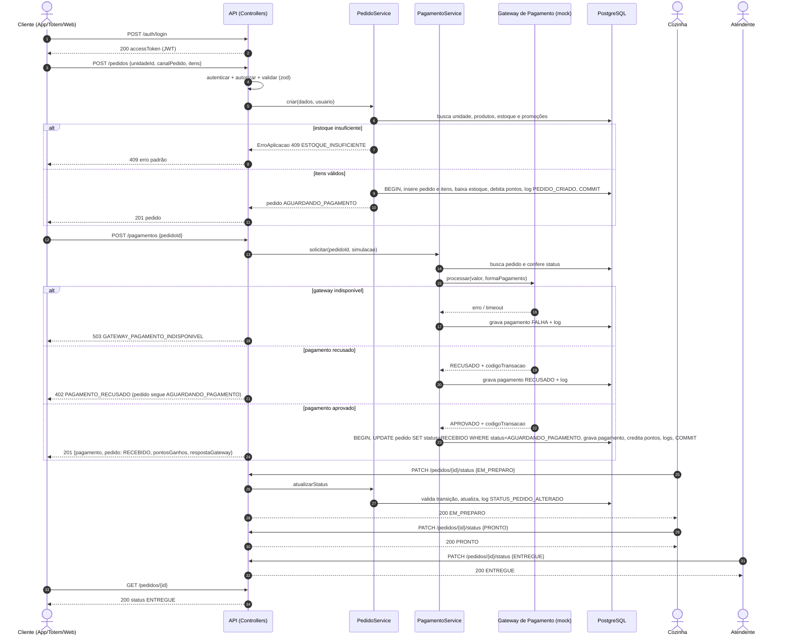

# Diagrama de Sequência - Pedido → Pagamento Externo → Atualização de Status

```mermaid
sequenceDiagram
    autonumber
    actor C as Cliente (App/Totem/Web)
    participant API as API (Controllers)
    participant PS as PedidoService
    participant PG as PagamentoService
    participant GW as Gateway de Pagamento (mock)
    participant DB as PostgreSQL
    actor K as Cozinha
    actor A as Atendente

    C->>API: POST /auth/login
    API-->>C: 200 accessToken (JWT)

    C->>API: POST /pedidos {unidadeId, canalPedido, itens}
    API->>API: autenticar + autorizar + validar (zod)
    API->>PS: criar(dados, usuario)
    PS->>DB: busca unidade, produtos, estoque e promoções
    alt estoque insuficiente
        PS-->>API: ErroAplicacao 409 ESTOQUE_INSUFICIENTE
        API-->>C: 409 erro padrão
    else itens válidos
        PS->>DB: BEGIN, insere pedido e itens, baixa estoque, debita pontos, log PEDIDO_CRIADO, COMMIT
        PS-->>API: pedido AGUARDANDO_PAGAMENTO
        API-->>C: 201 pedido
    end

    C->>API: POST /pagamentos {pedidoId}
    API->>PG: solicitar(pedidoId, simulacao)
    PG->>DB: busca pedido e confere status
    PG->>GW: processar(valor, formaPagamento)
    alt gateway indisponível
        GW-->>PG: erro / timeout
        PG->>DB: grava pagamento FALHA + log
        API-->>C: 503 GATEWAY_PAGAMENTO_INDISPONIVEL
    else pagamento recusado
        GW-->>PG: RECUSADO + codigoTransacao
        PG->>DB: grava pagamento RECUSADO + log
        API-->>C: 402 PAGAMENTO_RECUSADO (pedido segue AGUARDANDO_PAGAMENTO)
    else pagamento aprovado
        GW-->>PG: APROVADO + codigoTransacao
        PG->>DB: BEGIN, UPDATE pedido SET status=RECEBIDO WHERE status=AGUARDANDO_PAGAMENTO, grava pagamento, credita pontos, logs, COMMIT
        API-->>C: 201 {pagamento, pedido: RECEBIDO, pontosGanhos, respostaGateway}
    end

    K->>API: PATCH /pedidos/{id}/status {EM_PREPARO}
    API->>PS: atualizarStatus
    PS->>DB: valida transição, atualiza, log STATUS_PEDIDO_ALTERADO
    API-->>K: 200 EM_PREPARO
    K->>API: PATCH /pedidos/{id}/status {PRONTO}
    API-->>K: 200 PRONTO
    A->>API: PATCH /pedidos/{id}/status {ENTREGUE}
    API-->>A: 200 ENTREGUE
    C->>API: GET /pedidos/{id}
    API-->>C: 200 status ENTREGUE
```
